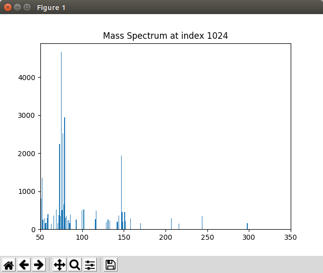
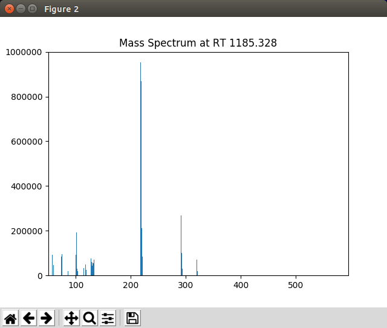

*********************
The Display Module
*********************

.. contents:: Table of Contents
	:local:

PyMassSpec has graphical capabilities to display information such as
:class:`~pyms.IonChromatogram.IonChromatogram` objects (ICs),
Total Ion Chromatograms (TICs), and detected lists of Peaks.

.. include:: demo_rst/Displaying_TIC.rst

When not running in Jupyter Notebook, the plot may appear in a separate window looking like this:

.. figure:: graphics/chapter08/test-70a.png
	:scale: 80
	:alt: Graphics window displayed by the script 70a/proc.py

	Graphics window displayed by the script 70a/proc.py

.. note:: This example is in `pyms-demo/jupyter/Displaying_TIC.ipynb` and `pyms-demo/70a/proc.py.

.. include:: demo_rst/Displaying_Multiple_IC.rst

When not running in Jupyter Notebook, the plot may appear in a separate window looking like this:

.. figure:: graphics/chapter08/test-70b.png
	:scale: 80
	:alt: Graphics window displayed by the script 70b/proc.py

	Graphics window displayed by the script 70b/proc.py

.. note:: This example is in `pyms-demo/jupyter/Displaying_Multiple_IC.ipynb` and `pyms-demo/70b/proc.py.

.. include:: demo_rst/Displaying_Mass_Spec.rst

When not running in Jupyter Notebook, the spectrum may appear in a separate window looking like this:

	Graphics window displayed by the script 70c/proc.py

.. note:: This example is in `pyms-demo/jupyter/Displaying_Mass_Spec.ipynb` and `pyms-demo/70c/proc.py.

.. include:: demo_rst/Displaying_Detected_Peaks.rst

The function :py:meth:`store_peaks() <pyms.Peak.List.IO.store_peaks>`
in ``proc_save_peaks.py`` stores the peaks, while
:py:meth:`load_peaks() <pyms.Peak.List.IO.load_peaks>`
in ``proc.py`` loads them for the Display class to use.

When not running in Jupyter Notebook, the plot may appear in a separate window looking like this:

.. figure:: graphics/chapter08/test-71-ICs.png
	:scale: 80
	:alt: Graphics window displayed by the script 71/proc.py

	Graphics window displayed by the script 71/proc.py

.. note:: This example is in `pyms-demo/jupyter/Displaying_Detected_Peaks.ipynb` and `pyms-demo/71/proc.py.

.. include:: demo_rst/Display_User_Interaction.rst

	The mass spectrum displayed by PyMassSpec when a peak in the graphics window is right clicked

To zoom in on a portion of the plot, select the |magnifier| button,
hold down the left mouse button while dragging a rectangle over
the area of interest. To return to the original view, click on the
|home| button.

The |cross| button allows panning across the zoomed plot.

.. |magnifier| image:: graphics/chapter08/magnifier_button.png

.. note:: This example is in `pyms-demo/jupyter/Display_User_Interaction.ipynb` and `pyms-demo/72/proc.py.

